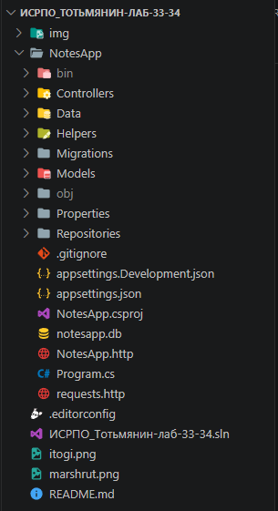
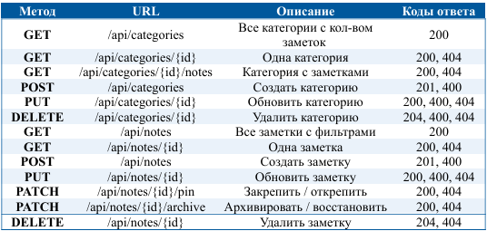
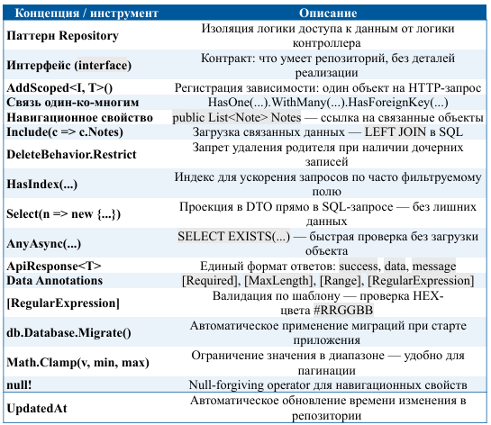

# Лабораторная работа №33-34: Полноценный CRUD с базой данных (NotesApp)

P.S: НИ В КОЕМ СЛУЧАЕ ЭТА РАБОТА И ВСЕ ПОСЛЕДУЮЩИЕ И ПРЕДЫДУЩИЕ НЕ НАПИСАНЫ С ПОМОЩЬЮ GPT И ТОМУ ПОДОБНОЕ!!! (ну практически, кроме README.md)

## Основная информация

- **ФИО:** Тотьмянин Тихон Алексеевич

- **Группа:** ИСП-232

- **Дата:** 11.05.2026  

## Описание работы

**NotesApp** — это ASP.NET Core Web API приложение для управления заметками и категориями. Проект демонстрирует реализацию полноценного CRUD-функционала с использованием Entity Framework Core, SQLite и паттерна Repository.  
Приложение поддерживает:

- Связь таблиц "один-ко-многим" (Категория → Заметки)
- Валидацию входных данных через Data Annotations
- Фильтрацию, поиск, пагинацию и сортировку заметок
- Операции закрепления (`pin`) и архивирования (`archive`)
- Единый формат JSON-ответов для успешных операций и ошибок
- Автоматическое применение миграций при запуске

## 💡 Главные выводы

1. Паттерн Repository не является избыточной абстракцией, а делает код управляемым при росте проекта.
2. Data Annotations решают двойную задачу: валидируют входные данные на уровне API и задают ограничения в схеме БД.
3. Единый формат ответа (```ApiResponse<T>```) упрощает интеграцию с фронтендом: клиент всегда знает структуру success, data, message.
4. ```DeleteBehavior.Restrict``` надёжно защищает связанные данные от случайного каскадного удаления.
5. Использование ```.Include()``` вместе с проекцией в DTO через ```.Select()``` позволяет эффективно загружать связанные данные без проблемы N+1 запросов.

## Структура проекта



## Запуск

```bash
cd NotesApp
dotnet restore
dotnet run
```

## Обязательная таблица маршрутов



## Итоговая таблица: что изучили в лабораторной


